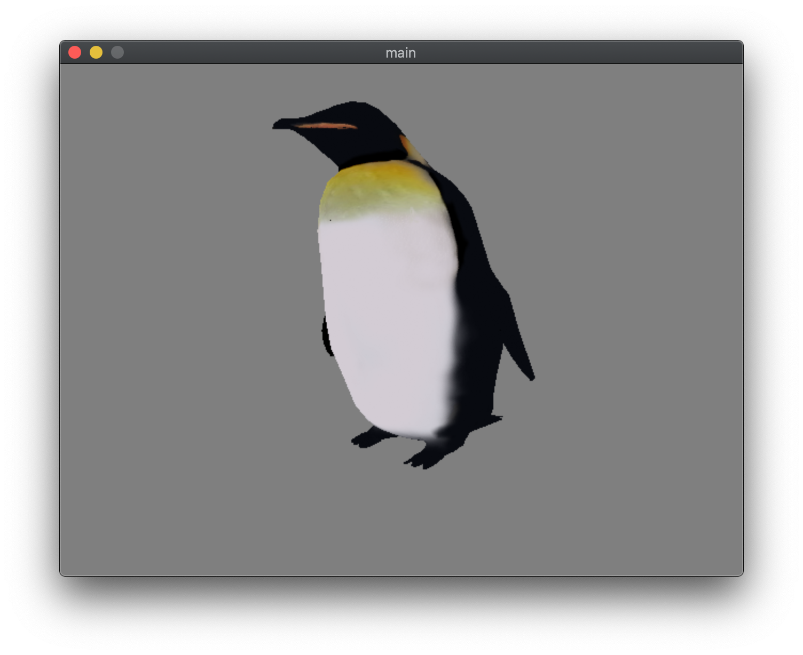

# fhasterizer

A toy C++ software rasterizer.

This uses SDL2 (just for window management, no drawing) and Eigen (for all the math stuff).

Current features:
- Basic .obj file loader
- Basic .ppm texture loading
- Renders textured mesh
